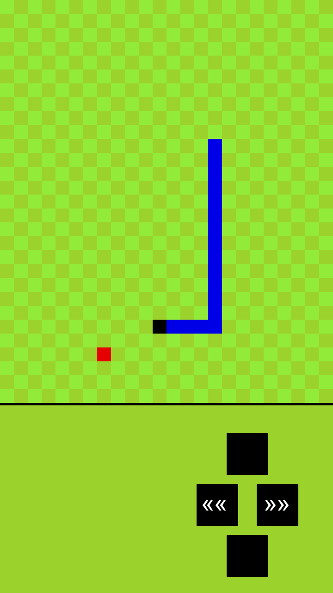
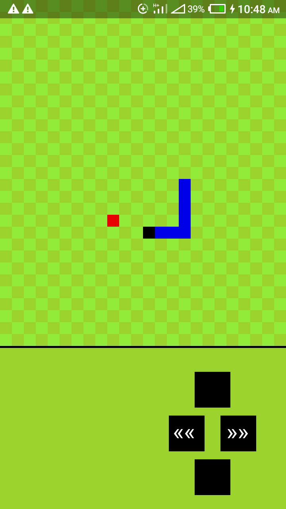

 # Snake Mania Game

**Snake Mania** is a 2D snake game built using the Pygame library. 

To play the game :

- **You need a Python IDE with Pygame installed on it.** I would suggest you use Pydroid App if you're using an android device. 

- Go to your command line and clone this github repo using:
 `git clone https://github.com/DamyKS/Snake_Mania_Game `

- On your device, open the snake_mania.py file found in the Snake_Mania_Game directory  using a Python IDE. 

- The game should start and you can now start playing it.  Enjoy!!!

Demo pictures :

 
 
